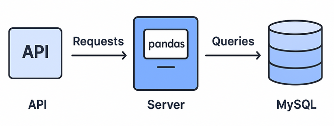

# Pipeline



## 🎯 Description

This repository shows several projects demonstrating data pipelines, from data collection and augmentation (image transformations and public APIs) to data cleaning, analysis and visualization using Python and pandas. It also covers data storage and processing with MySQL and MongoDB, including advanced queries and log analysis.

## ⚙️ Technologies

python3 (version 3.9)  
pandas (version 2.2.2)  
numpy (version 1.25.2)  
matplotlib (version 3.8.3)  
requests (version 2.32.4)  
MySQL 8.0 (version 8.0.39)  
MongoDB (version 4.4.29)  
PyMongo (version 4.6.2)

## 📁 Clone the repository

```
git clone https://github.com/TonyHolby/holbertonschool-machine_learning.git
cd pipeline/
```

## 📄 Structure

```
📂 pipeline/
├── 📂 apis/                    # Public API consumption scripts
├── 📂 pandas/                  # Data manipulation with pandas
├── 📂 databases/               # MySQL and MongoDB databases operations
└── 📄 README.md                # Project documentation
```

## 👤 Author

Tony NEMOUTHE
