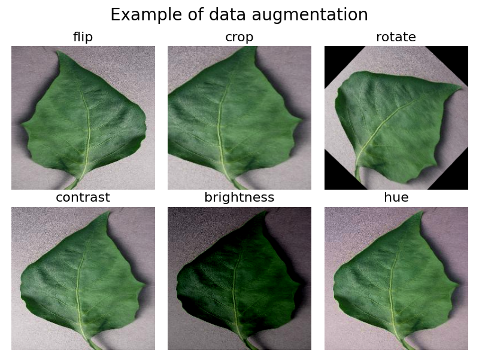

# Data augmentation



## 🎯 Description

This project focuses on image data augmentation techniques. It shows how to perform transformations such as horizontal flipping, random cropping, rotation, brightness changes and hue adjustments on images. These techniques help to increase the dataset diversity.

## ⚙️ Technologies

tensorflow (version 2.15.0)  
python3 (version 3.9)  

## 📁 Clone the repository

```
git clone https://github.com/TonyHolby/holbertonschool-machine_learning.git
cd pipeline/data_augmentation/
```

## 📄 Structure

```
📂 data_augmentation/
├── 📄 0-flip.py                  # Flips an image horizontally
├── 📄 1-crop.py                  # Performs a random crop of an image
├── 📄 2-rotate.py                # Rotates an image
├── 📄 3-contrast.py              # Randomly adjusts the contrast of an image
├── 📄 4-brightness.py            # Randomly changes the brightness of an image
├── 📄 5-hue.py                   # Changes the hue of an image
└── 📄 README.md                  # Project documentation
```

## 👤 Author

Tony NEMOUTHE
