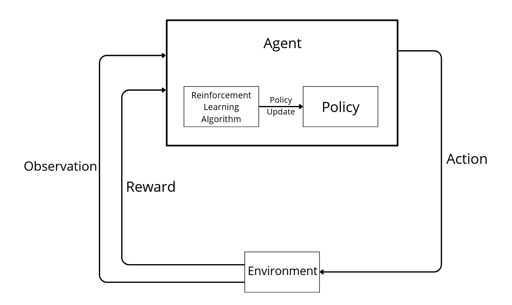

# <p align="center">Reinforcement Learning</p>



## 🎯 Description

This repository contains projects on reinforcement learning algorithms including Q-learning, temporal difference methods, policy gradients and deep Q-networks (DQN). These algorithms enable an agent to learn through interactions with its environment.

## ⚙️ Technologies

python3 (version 3.9)
gymnasium (version 0.29.1)  
tensorflow (version 2.15.0)  
keras (version 2.15.0)  
keras-rl2 (version 1.0.4)  
numpy (version 1.25.2)  
Pillow (version 10.3.0)  
matplotlib (version 3.8.3)

## 📁 Clone the repository

```
git clone https://github.com/TonyHolby/holbertonschool-machine_learning.git
cd reinforcement_learning/
```

## 📄 Structure

```
📂 reinforcement_learning/
├── 📂 q_learning/               # Q-learning algorithm
├── 📂 temporal_difference/      # Temporal difference learning methods
├── 📂 policy_gradients/         # Policy gradient methods
├── 📂 deep_q_learning/          # Deep Q-Network for Atari games
└── 📄 README.md                 # Project documentation
```

## 👤 Author

Tony NEMOUTHE
