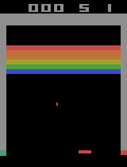

# Deep Q-Learning project

## 🎯 Description

This project implements a Deep Q-Network (DQN) agent capable of playing the Atari arcade game Breakout. It includes scripts for training the agent and visualizing its gameplay.

train.py: a python script to train an agent to play the Atari game Breakout using a Deep Q-Network (DQN) algorithm.  
Libraries used: numpy, pillow, tensorflow, keras, keras-rl2, gymnasium.

play.py: a python script to visualize the trained agent playing Breakout.  
Libraries used: numpy, pillow, tensorflow, keras, keras-rl2, gymnasium, matplotlib.

## 📁 Clone the repository

git clone https://github.com/TonyHolby/holbertonschool-machine_learning.git  
cd reinforcement_learning/deep_q_learning/

## 📄 Structure

<pre>📂 deep_q_learning/
├── 📄 train.py         # Script to train the DQN agent
├── 📄 play.py          # Script to visualize the trained agent
└── 📄 README.md        # Project documentation</pre>

## 🤖 Usage

1. Training the DQN agent:

Run the script: python train.py  
Output: the model weights will be saved as policy.h5

2. Playing with the trained agent:

Run the script: python play.py  
Output: the visualization of the DQN agent playing Breakout

## 💡 Reference

- Mnih, V. et al. (2013). *Playing Atari with Deep Reinforcement Learning.* arXiv:1312.5602.

## 👤 Author

Tony NEMOUTHE