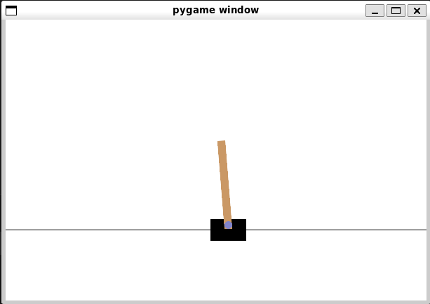

# <p align="center">Policy Gradients</p>



## 🎯 Description

This project implements policy gradient methods for reinforcement learning. Policy gradients optimize the policy function to maximize expected rewards making them effective for continuous action spaces and complex environments.

## ⚙️ Technologies

python3 (version 3.9)  
numpy (version 1.25.2)  
matplotlib (version 3.8.3)

## 📁 Clone the repository

```
git clone https://github.com/TonyHolby/holbertonschool-machine_learning.git
cd reinforcement_learning/policy_gradients/
```

## 📄 Structure

```
📂 policy_gradients/
├── 📄 policy_gradient.py       # Policy gradient algorithm
├── 📄 train.py                 # Training script
└── 📄 README.md                # Project documentation
```

## 👤 Author

Tony NEMOUTHE
